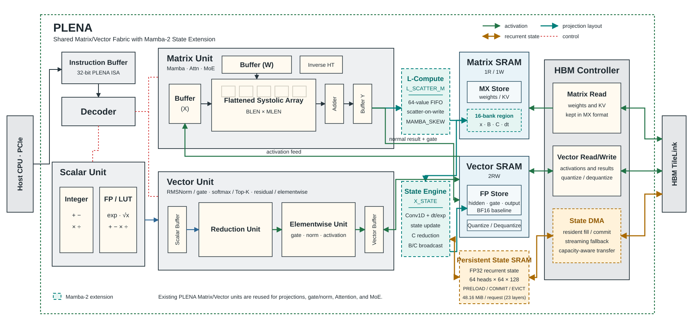
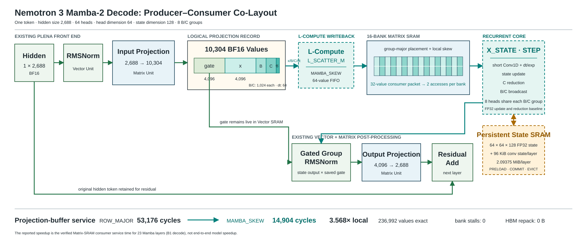

# PLENA Compiler：Mamba / KDA 支持

这个分支让 PLENA Compiler 能描述并生成两类混合模型的执行程序：

- **Nemotron 3 Nano**：52 层，包括 23 层 Mamba、23 层 MoE、6 层 Attention。
- **Kimi K3**：93 层，包括 69 层 KDA、24 层 MLA，以及对应的 MoE。

Compiler 负责生成指令、内存地址和 descriptor；真正执行这些指令的是
[PLENA Simulator](https://github.com/AICrossSim/PLENA_Simulator/tree/feature/mamba-kda-support)。

## 架构图

两张图分别回答两个问题：PLENA 整体增加了什么，以及一个 Mamba token 怎么执行。

### Figure 1：Hybrid PLENA 总体架构



[SVG](docs/architecture/hybrid_plena_mamba.svg)

这张图保留原 PLENA 的 Scalar、Matrix、Vector、SRAM 和 HBM 主体，只在真实的
Matrix 写回与状态数据路径上加入 Mamba 扩展。同一套 Matrix/Vector 单元继续执行
Attention、MoE 和 Mamba 的矩阵计算。输入投影完成后，`L_SCATTER_M` 根据 `X_STATE`
下一拍的读取方式重新安排 SRAM bank；`X_STATE` 再从独立的 persistent state cache
读取并更新 recurrent state。图中虚线模块已在 Compiler 和 Rust Simulator 中实现，
但尚未进入 RTL/PPA。

### Figure 2：Nemotron 3 Mamba-2 decode 数据流



[SVG](docs/architecture/mamba2_lcompute_flow.svg)

这张图展示一个真实尺寸的 Nemotron 3 Mamba decode token。`gate` 留在 Vector SRAM，
`x/B/C/dt` 经过 16-bank group-major skew 排布后交给 state engine；该排布只改变物理
bank 地址，不改变 tensor 数值，也不产生 HBM transpose/repack 流量。图中的 3.568x
是 projection-buffer 的局部读取服务提升，不是整层或整模加速比。

## 数据怎么走

```text
hidden state
  -> Matrix projection
  -> L_SCATTER_M：按下一步的读取方式把数据放进不同 SRAM bank
  -> X_STATE：执行 Mamba-2 或 KDA 状态更新
  -> Vector / Matrix：门控、归一化、输出投影
  -> Attention / MLA / MoE / residual
```

`L_SCATTER_M` 只改变数据在 SRAM bank 中的物理位置，不改变 tensor 数值；
`X_STATE` 用同一套指令格式执行 Mamba-2 和 KDA，两者通过 descriptor 区分。

## 当前进度

| 内容 | 状态 | 说明 |
|---|:---:|---|
| Mamba-2 / KDA 指令和 descriptor | 完成 | Compiler 与 Simulator 使用同一份二进制格式 |
| `L_SCATTER_M` bank 排布 | 完成 | 支持 row-major、transpose、Mamba、KDA 和自定义模式 |
| Nemotron 3 层结构 | 完成 | 23 Mamba + 23 MoE + 6 Attention，完整程序可汇编 |
| Kimi K3 层结构 | 完成 | 69 KDA + 24 MLA 的结构 trace 已生成 |
| Matrix、Attention、MoE、residual 连接 | 完成 | 缩小外围尺寸的程序已在 Rust Simulator 数值对拍 |
| Compact Matrix 循环 | 完成 | MXFP8 GEMM 与 BF16 stream-K 均在 Rust 中逐元素一致 |
| Nemotron 52 层机器码 | 完成 | 6,202,663 条、23.66 MiB；参数由 symbolic HBM manifest 描述 |
| Kimi 93 层机器码 | 完成 | 96-head 共 11,502,370 条，原始机器码 43.88 MiB |
| 4-token GQA / compressed-MLA cache | 完成 | Nemotron 32Q/2KV GQA 与 Kimi 96-head MLA 已在同一 HBM 实例中逐 token 追加并完成 Rust 数值对拍 |
| Synthetic prefill | 完成 | S16/S128 Mamba/KDA chunk、GQA/compressed-MLA cache 和 multi-token MoE 均在 Rust 对拍 |
| Compact synthetic 整模 | 完成 | Nemotron 52 层与 Kimi 93 层均连续执行 S16 prefill + decode 4 token |
| 真实 checkpoint 整模执行 | 未完成 | 不能把 compact synthetic 周期写成真实 Nemotron/Kimi latency |
| RTL、频率、面积和端到端加速比 | 未开始 | 属于下一阶段，不是本仓库当前结论 |

4-token 测试保留真实 attention/cache 维度，只缩小外围 hidden rank：

| 路径 | 真实维度 | Rust 结果 | HBM cache |
|---|---|---|---|
| Nemotron GQA | 32 query heads、2 KV heads、head dim 128 | 输出 100% allclose；4 个 K/V cache 全部 exact | 4,096 B logical K/V history |
| Kimi compressed MLA | 96 heads、Q/K 192、V 128、compressed 576、4 个不同 RoPE 位置 | 输出、compressed history、重建 K/V 全部 exact | 4,608 B persistent latent + 一对固定 single-head scratch |

Kimi 的测试会扫描 Compiler HBM 注册表；任何额外的 all-head expanded K/V cache 都会
直接失败。4-token 展开方案需要 245,760 B，而实际 persistent history 是 4,608 B，
缩小 53.33x。该数字只比较 cache payload，不包含权重和 SRAM guard rows。

## 快速开始

```bash
git clone --branch feature/mamba-kda-support \
  https://github.com/AICrossSim/PLENA_Compiler.git
cd PLENA_Compiler
uv sync --frozen
```

运行核心测试：

```bash
uv run pytest -q -m "not slow" \
  assembler/tests/test_x_state_encoding.py \
  assembler/tests/test_l_scatter_m_encoding.py \
  aten/tests/test_hybrid_substrate.py \
  aten/tests/test_compact_matrix_loops.py \
  aten/tests/test_nemotron3_hybrid.py \
  aten/tests/test_kimi_k3_hybrid.py
```

多-token cache 的 Rust 数值测试位于配套 Simulator 分支；下面两条命令需在
`PLENA_Simulator` checkout 中运行：

```bash
nix develop --no-write-lock-file --command just test-nemotron3-gqa-cache
nix develop --no-write-lock-file --command just test-kimi3-mla-cache
nix develop --no-write-lock-file --command just test-state-prefill --model all --tokens 16
nix develop --no-write-lock-file --command just test-state-prefill --model all --tokens 128
nix develop --no-write-lock-file --command just test-moe-prefill --model all --tokens 16
nix develop --no-write-lock-file --command just test-moe-prefill --model all --tokens 128
nix develop --no-write-lock-file --command just test-nemotron3-full-synthetic
nix develop --no-write-lock-file --command just test-kimi3-full-synthetic
```

完整的分支测试列表见 [CI 配置](.github/workflows/ci.yml)。TileLang/TVM 不是
默认依赖；只有开发 TileLang 路径时才运行 `uv sync --frozen --group tvm`。

## 生成模型 trace

Nemotron 3 decode：

```bash
uv run python -m aten.nemotron3.trace \
  --phase decode --decode-tokens 1 \
  --output build/nemotron3.json \
  --mamba-physical-output build/nemotron3-mamba.json \
  --mamba-physical-asm-output build/nemotron3-mamba.s
```

Kimi K3 decode：

```bash
uv run python -m aten.kimi3.trace \
  --phase decode --batch-size 1 --state-cache-mib 32 \
  --output build/kimi-k3.json
```

生成完整单 token decode 机器码和 symbolic-weight 地址清单：

```bash
uv run python -m aten.nemotron3.artifact build/nemotron3-decode
uv run python -m aten.kimi3.artifact build/kimi-k3-decode
```

每个目录包含 `.mem`、state/layout descriptors、FPRAM 常量、symbolic HBM
manifest、SHA256 和一份 summary。Kimi 的全量构建约需 2 分钟和 5 GiB 主存；它不会
下载 checkpoint。

这些命令不下载模型权重。`.mem` 中的指令已经逐条编码，但 manifest 中的参数仍是
待填充地址，所以不代表真实 checkpoint 已经从第一层执行到最后一层。

## 代码位置

| 目录 | 内容 |
|---|---|
| `aten/state/` | 共用的 `X_STATE`、`L_SCATTER_M`、内存和 residency 规则 |
| `aten/mamba/`、`aten/kda/` | 两种状态模型的调度和 projection lowering |
| `aten/nemotron3/`、`aten/kimi3/` | 两个真实模型的层结构和 connected program |
| `spec/` | Compiler/Simulator 共用的二进制 contract 和 golden 数据 |
| `doc/` | ISA、地址布局和未完成项的详细设计说明 |

## 结果应该怎么理解

本分支与配套 Simulator 已证明：Compiler 能生成一致的指令和数据布局，S16/S128
prefill 可执行，且 compact synthetic 52/93 层能从第一层连续运行到最后一层。它还
没有证明真实 checkpoint 精度与 latency、RTL 时序、FPGA PPA 或相对 GPU 的端到端加速。
